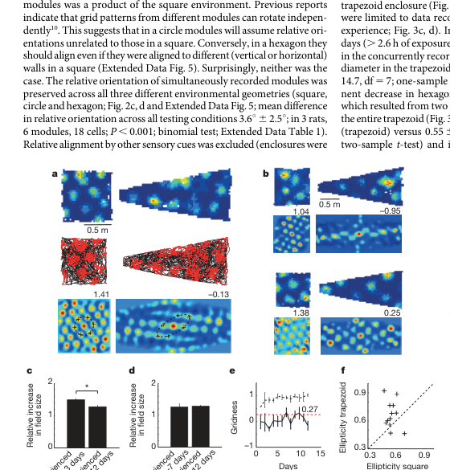
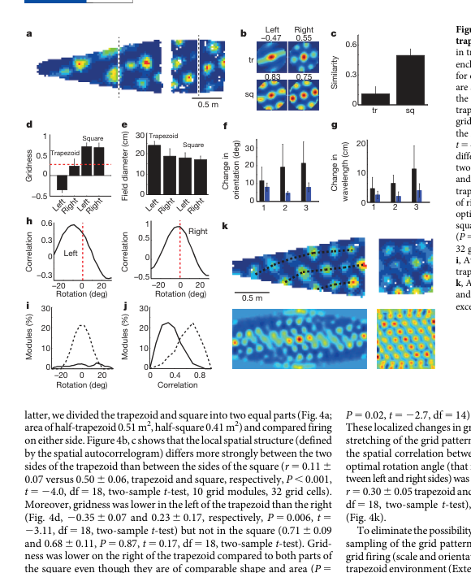

This note is a literature checkpoint rather than a derivation. The question is simple:

If grid cells really implement a clean internal spatial metric, then what happens when the animal explores an enclosure whose geometry is strongly polarized or deformed?

The short answer from experiment is: **the grid is not perfectly rigid**. In sufficiently non-regular environments, grid firing patterns can become stretched, less hexagonal, locally non-uniform, and history-dependent.

## The Phenomenon

The clearest empirical message from the literature is that environmental geometry can reshape grid firing in at least three related ways:

1. **Global distortion**: the lattice can become less hexagonal and more elliptical.
2. **Local distortion**: different parts of the same enclosure can carry different local grid structure.
3. **Deformation-specific remapping of metric**: compression or expansion of the enclosure can change grid spacing and apparent field positions, often in a boundary-dependent way.

So the naive statement

$$
\text{grid cell firing fields are a universal, geometry-invariant hexagonal metric}
$$

is too strong.

## Classic Trapezoid Result

One of the strongest demonstrations is the trapezoid experiment of [Krupic et al. (2015)](https://www.nature.com/articles/nature14153), who compared firing in square and trapezoidal environments.

Their main qualitative findings were:

- in squares, grid patterns retained stronger hexagonal regularity
- in trapezoids, the pattern became more elliptical and less homogeneous
- the distortion was not only global; the narrow and wide sides of the trapezoid showed different local structure

*Biological data from Figure 3 of Krupic et al. (2015), cropped from the paper PDF. The same cells show cleaner hexagonal structure in the square and visibly distorted, stretched patterns in the trapezoid.*

*Biological data from Figure 4 of Krupic et al. (2015), cropped from the paper PDF. The left and right sides of the trapezoid do not carry identical local grid structure: the pattern rotates, stretches, and changes field size across the enclosure.*

For my own purposes, this is the most important observation: **the distortion is not just a single uniform affine warp of an otherwise perfect lattice**. The same enclosure can induce different local grid structure in different subregions.

## Beyond Trapezoids: Environmental Deformation

Later work pushed this farther by asking what happens when familiar enclosures are compressed, stretched, or otherwise deformed.

In [Keinath, Epstein, and Balasubramanian (2018)](https://elifesciences.org/articles/38169), the authors argued that environmental deformations produce systematic shifts in the grid metric that are better understood as **boundary-tethered, history-dependent distortions** than as a simple global rescaling. In other words, the apparent grid can depend on how recent boundary encounters anchor the phase pattern.

This is useful because it says the deformation effect is not merely a static shape issue. It depends on how self-motion integration interacts with environmental boundaries over time.

Related evidence from [Munn et al. (2020)](https://pubmed.ncbi.nlm.nih.gov/32814067/) showed that entorhinal velocity-related signals themselves reflect environmental geometry. That result matters because it suggests the distortion may enter not only at the level of the final firing map, but also upstream in the velocity coding and path-integration machinery.

## What I Take From These Papers

For this notebook, the current takeaway is:

1. A grid pattern should not be treated as an always-perfect Euclidean ruler.
2. Strongly polarized geometry can bias orientation, spacing, ellipticity, and local homogeneity.
3. A narrow rectangle or a trapezoid should not be expected to preserve the same lattice visible in a square.
4. If I build demos later, it will be worth distinguishing:
   - a purely internal oscillatory/interference mechanism
   - boundary-driven anchoring or correction
   - velocity-code distortion induced by enclosure geometry

So the next conceptual question is no longer only “how do multiple waves form a hexagonal pattern?” It is also:

$$
\text{how does environmental geometry bend or constrain that pattern?}
$$

## References

- Krupic J, Bauza M, Burton S, Barry C, O'Keefe J. [Grid cell symmetry is shaped by environmental geometry](https://www.nature.com/articles/nature14153). *Nature*. 2015.
- Keinath AT, Epstein RA, Balasubramanian V. [Environmental deformations dynamically shift the grid cell spatial metric](https://elifesciences.org/articles/38169). *eLife*. 2018.
- Munn RGK, Rikhye RV, Sreenivasan S, et al. [Entorhinal velocity signals reflect environmental geometry](https://pubmed.ncbi.nlm.nih.gov/32814067/). *Nature Neuroscience*. 2020.
