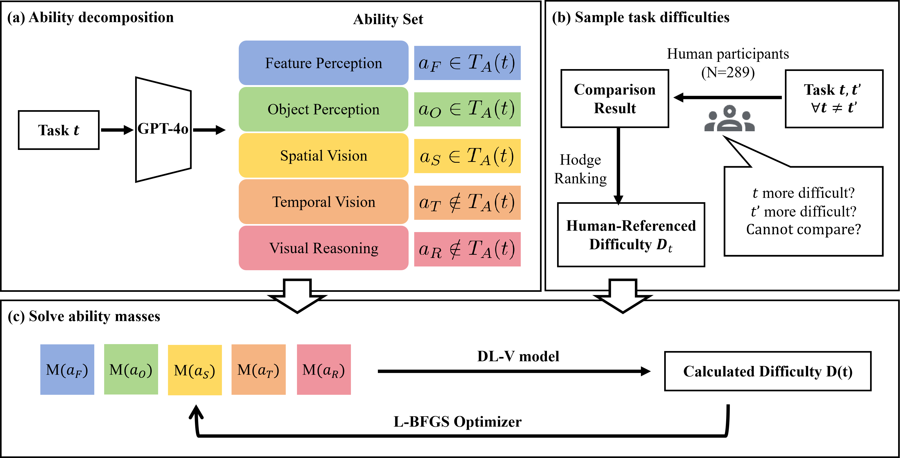
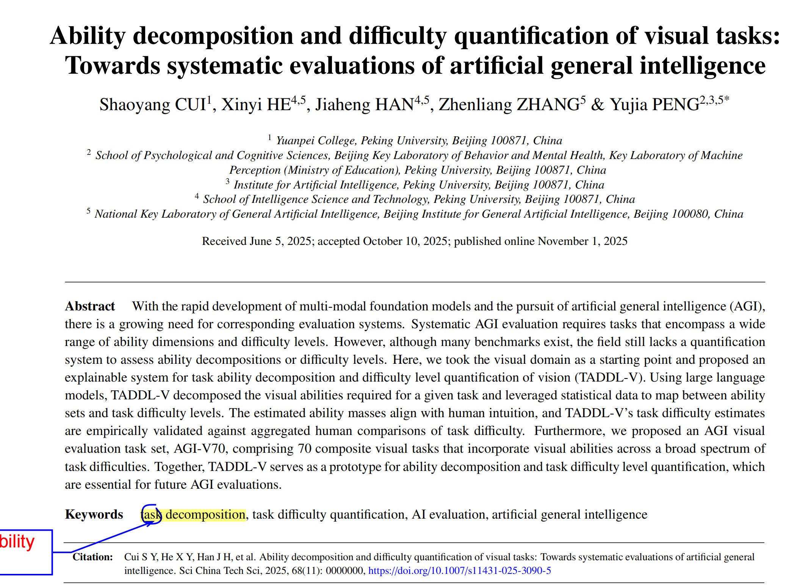

This work represents a significant advance in AGI evaluation methodology by providing the first comprehensive framework for understanding and quantifying visual task difficulty. 

## Key Contributions

- **Novel Theoretical Framework**: First exploration of task-ability space structure and its relationship to task difficulty
- **TADDL-V Framework**: Systematic approach for quantifying difficulty of visual tasks
- **AGI-V70 Benchmark**: Curated dataset for testing diverse visual abilities
- **Practical Impact**: Tools and methods that advance the field of AGI evaluation

## Significance

This research addresses a critical gap in AGI evaluation by providing rigorous theoretical foundations and practical tools for assessing artificial intelligence capabilities across visual domains. The work has been accepted for publication in Science China Technological Sciences, a prestigious Q1 journal, reflecting its contribution to the field.

The TADDL-V framework and AGI-V70 benchmark are freely available to the research community, promoting open science and collaborative advancement in AGI evaluation.

## Visual teasers

