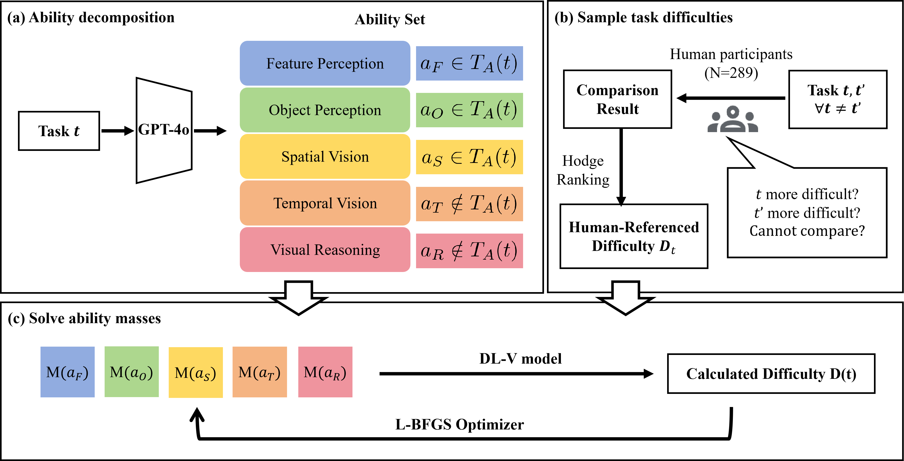

This work represents a significant advance in AGI evaluation methodology by providing the first comprehensive framework for understanding and quantifying visual task difficulty. 

## Key Contributions

- **Novel Theoretical Framework**: First exploration of task-ability space structure and its relationship to task difficulty
- **TADDL-V Framework**: Systematic approach for quantifying difficulty of visual tasks
- **AGI-V70 Benchmark**: Curated dataset for testing diverse visual abilities
- **Practical Impact**: Tools and methods that advance the field of AGI evaluation

## Motivation

Using the visual domain as a starting point, this research addresses a critical gap in AGI evaluation by introducing a methodology to quantify the difficulty levels of composite tasks. This quantification is crucial for conducting a more comprehensive and fine-grained assessment of AGI systems. 

To promote open science and collaborative advancement, the TADDL-V framework and the AGI-V70 benchmark are made freely available to the research community.

## Visual teaser

